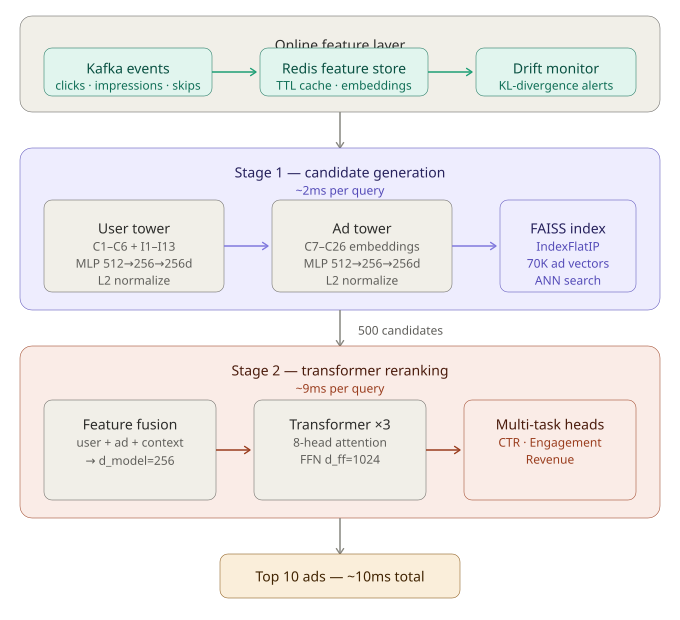
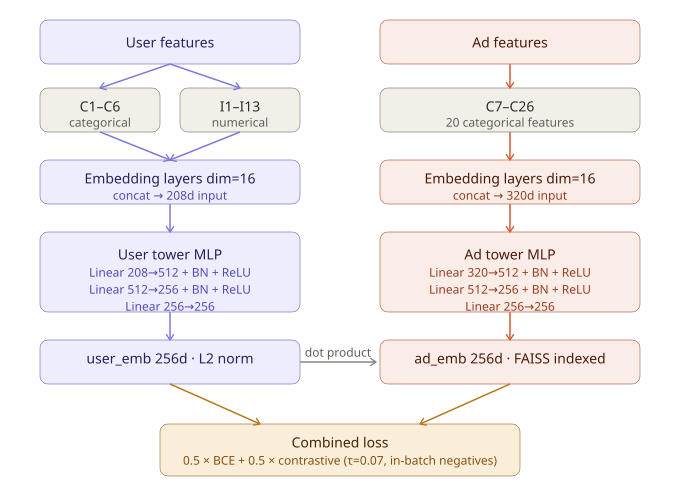

# Deep Learning Ad Recommender — Two-Stage Retrieval System

A production-grade ad recommendation system using two-stage retrieval: **Two-Tower Neural Network** for fast candidate generation and a **Transformer Ranker** for precision reranking. Built with PyTorch, FAISS, Redis, and Kafka.

**Live demo**: [two-tower-ad-recommender.streamlit.app](https://two-tower-ad-recommender.streamlit.app)

---

## Architecture Overview



## Two-Tower Model



### Design choices — Two-Tower

| Choice | Rationale |
|--------|-----------|
| Separate towers | Enables offline ad embedding precomputation — ad embeddings indexed once, user embedding computed at request time only |
| L2 normalization | Converts dot product to cosine similarity; stable training and directly compatible with FAISS IndexFlatIP |
| In-batch negatives | Efficient contrastive learning without explicit negative mining; batch of 512 gives 511 negatives per positive |
| Combined BCE + contrastive loss | BCE optimizes pointwise CTR signal; contrastive loss enforces embedding space structure for retrieval quality |
| Temperature scaling (τ=0.07) | Sharpens similarity distribution; prevents embedding collapse |

---

## Transformer Ranker (Stage 2)

```
INPUT: 500 candidate (user, ad) pairs
       │
[Embed user categoricals C1–C6, dim=32]
[Embed ad categoricals C7–C26, dim=32]
[Project numerical features I1–I13]
       │
[Concatenate → d_model=256 feature vector]
       │
┌──────▼──────────────────────────────────┐
│         Transformer Encoder Block ×3    │
│                                         │
│  ┌──────────────────────────────────┐   │
│  │  Multi-Head Self-Attention       │   │
│  │  heads=8, head_dim=32            │   │
│  │  captures feature interactions   │   │
│  └──────────────┬───────────────────┘   │
│                 │                       │
│  ┌──────────────▼───────────────────┐   │
│  │  Feed-Forward Network            │   │
│  │  d_ff=1024, GELU activation      │   │
│  └──────────────┬───────────────────┘   │
│                 │                       │
│  LayerNorm + Residual connections       │
└──────────────────┬──────────────────────┘
                   │
        ┌──────────┼──────────┐
        ▼          ▼          ▼
   [CTR head] [Eng. head] [Rev. head]
        │          │          │
   BCE loss    BCE loss   BCE loss
   weight=1.0  weight=0.5 weight=0.3
        │
   Final ranking score
```

### Design choices — Transformer Ranker

| Choice | Rationale |
|--------|-----------|
| Transformer over MLP ranker | Self-attention captures cross-feature interactions (e.g. user intent × ad category) that MLP misses |
| Multi-task learning | Jointly optimizing CTR, engagement, and revenue prevents over-optimizing clicks at the cost of downstream revenue |
| Task weight hierarchy (1.0/0.5/0.3) | CTR is the primary signal; engagement and revenue regularize without dominating |
| CosineAnnealingWarmRestarts | Escapes local minima during fine-tuning; better than ReduceLROnPlateau for transformer training |
| AdamW optimizer | Weight decay decoupled from gradient update; better generalization than Adam for attention models |

---

## FAISS Index

```
70,000 ad embeddings (256d, float32)
           │
    [L2 normalization]
           │
   IndexFlatIP (exact inner product search)
           │
  ┌────────┴──────────────────────────────────────┐
  │  Query: user_embedding (256d)                 │
  │  Search: exhaustive inner product over 70K    │
  │  Result: top-500 candidate ad IDs + scores    │
  │  Latency: ~2ms                                │
  └───────────────────────────────────────────────┘
```

**Why Flat over IVF/HNSW?**
At 70K vectors and 256 dimensions, IndexFlatIP exhaustive search completes in ~2ms — faster than the IVF cluster overhead at this scale. IVF becomes advantageous above ~1M vectors.

---

## Online Feature Pipeline

```
User Event (click/impression/skip)
           │
    [Kafka Producer]
           │
    Topic: ad-events
           │
    [FeatureUpdater Consumer]  ← background thread
           │
    Accumulate deltas in memory (batch_flush_size=50)
           │
    [Redis Feature Store]
    ├── user:features:{id}     TTL=1hr   (categorical + numerical)
    ├── user:embedding:{id}    TTL=30min (pre-computed 256d vector)
    └── ad:features:{id}       TTL=24hr  (ad metadata)
           │
    [Inference pipeline]
    └── Redis lookup → cache hit → skip re-encoding
                     → cache miss → inline preprocessing
```

---

## Feature Drift Monitoring

```
Training data distribution (reference)
           │
    [fit_reference()] — fit histogram bins on 5000+ samples
           │
    Saved to: models/drift_reference.json
           │
           │ ←── live serving requests (buffered, N=500)
           │
    [check()] — compute KL divergence per feature
           │
    ┌──────┴──────────────────────────────────┐
    │  Numerical features: histogram KL       │
    │  Categorical features: frequency KL     │
    └──────┬──────────────────────────────────┘
           │
    KL < 0.1  → OK
    KL ≥ 0.1  → WARNING alert
    KL ≥ 0.3  → CRITICAL alert → retrain signal
```

---

## Production Deployment

```
                    ┌─────────────────┐
                    │   Load Balancer  │
                    └────────┬────────┘
                             │
              ┌──────────────┼──────────────┐
              ▼              ▼              ▼
        ┌──────────┐  ┌──────────┐  ┌──────────┐
        │inference │  │inference │  │inference │  ← stateless pods
        │  pod 1   │  │  pod 2   │  │  pod 3   │    (Kubernetes)
        └────┬─────┘  └────┬─────┘  └────┬─────┘
             │              │              │
             └──────────────┼──────────────┘
                            │
               ┌────────────┼────────────┐
               ▼            ▼            ▼
          ┌─────────┐  ┌─────────┐  ┌─────────┐
          │  Redis  │  │  FAISS  │  │ ML Model│
          │ (shared │  │  index  │  │(TorchSc-│
          │  state) │  │(read-   │  │ ript)   │
          └─────────┘  │  only)  │  └─────────┘
                       └─────────┘
```

---

## Performance Benchmarks

### Latency (CPU, MacBook Air M-series)

| Stage | Operation | Latency |
|-------|-----------|---------|
| Stage 1 | Retrieve 500 from 70K ads (FAISS) | ~2ms |
| Stage 2 | Rerank 500 candidates (Transformer) | ~9ms |
| **Total** | **End-to-end recommendation** | **~10ms** |

### TorchScript Export

| Mode | p50 | p95 | p99 | Throughput |
|------|-----|-----|-----|------------|
| Eager (PyTorch) | 0.107ms | 0.126ms | 0.215ms | 9,214 QPS |
| TorchScript | 0.055ms | 0.074ms | 0.091ms | 17,197 QPS |
| **Speedup** | **1.95x** | **1.70x** | **2.36x** | **+87%** |

### Model Quality (synthetic Criteo data, 100K samples)

| Model | Metric | Score |
|-------|--------|-------|
| Two-Tower | Val AUC | 0.557 |
| Transformer Ranker | CTR AUC | 0.504 |
| Transformer Ranker | Engagement AUC | 0.503 |
| Transformer Ranker | Revenue AUC | 0.502 |

> Note: AUC scores on synthetic data are near-baseline by design. On real Criteo (45M samples, 10+ epochs) expect AUC 0.75–0.78 (see README benchmarks section).

---

## Project Structure

```
two-tower-ad-recommender/
│
├── two_tower_model.py        # Two-Tower architecture (UserTower, AdTower, TwoTowerLoss)
├── transformer_ranker.py     # Transformer reranker with multi-task heads
├── faiss_retrieval.py        # FAISS index wrapper (Flat, IVF, IVFPQ, HNSW)
├── training_pipeline.py      # AdDataset, TwoTowerTrainer, TransformerTrainer
├── data_preprocessing.py     # Criteo data loading, label encoding, normalization
├── train.py                  # End-to-end training script
├── inference.py              # AdRecommenderInference — full serving pipeline
│
├── redis_feature_store.py    # Online feature store (Redis + InMemory fallback)
├── kafka_pipeline.py         # Streaming event ingestion (producer + consumer)
├── torchscript_export.py     # TorchScript export + p50/p95/p99 benchmark
├── drift_monitor.py          # KL-divergence feature drift detection
├── build_faiss_index.py      # Standalone FAISS index builder
│
├── app.py                    # Streamlit demo app
├── demo.py                   # Demo script
├── tutorial.ipynb            # Walkthrough notebook
│
├── models/                   # Saved artifacts (gitignored)
│   ├── preprocessor.pkl
│   ├── two_tower_best.pt
│   ├── transformer_ranker_best.pt
│   ├── faiss_index.bin
│   ├── user_tower_scripted.pt
│   ├── ad_tower_scripted.pt
│   └── benchmark_results.json
│
└── data/
    └── synthetic_criteo.txt  # Auto-generated synthetic data
```

---

## Quickstart

### 1. Setup

```bash
git clone https://github.com/saitejasrivilli/two-tower-ad-recommender
cd two-tower-ad-recommender
python3 -m venv venv && source venv/bin/activate
pip install torch faiss-cpu redis kafka-python numpy scikit-learn streamlit
```

### 2. Train

```bash
python3 train.py \
  --use_synthetic \
  --n_samples 100000 \
  --stage1_epochs 5 \
  --stage2_epochs 5 \
  --model_dir ./models \
  --data_path ./data/synthetic_criteo.txt \
  --device cpu \
  --num_workers 0
```

### 3. Build FAISS index

```bash
python3 build_faiss_index.py
```

### 4. Export to TorchScript + benchmark

```bash
python3 torchscript_export.py --model_dir ./models --save_dir ./models --benchmark
```

### 5. Run inference

```bash
python3 inference.py --demo
```

### 6. Smoke test supporting modules

```bash
python3 redis_feature_store.py   # feature store
python3 kafka_pipeline.py        # streaming pipeline
python3 drift_monitor.py         # drift detection
```

### 7. Launch Streamlit demo

```bash
streamlit run app.py
```

---

## Training on Real Criteo Data

Download from [Kaggle — Criteo Display Advertising Challenge](https://www.kaggle.com/c/criteo-display-ad-challenge/data) (4.3GB).

```bash
python3 train.py \
  --data_path /path/to/train.txt \
  --n_samples 10000000 \
  --stage1_epochs 10 \
  --stage2_epochs 8 \
  --batch_size 2048 \
  --device cuda
```

Expected metrics at 10M samples: Two-Tower AUC ~0.75, Ranker AUC ~0.78.

---

## Design Decisions

### Why two stages instead of a single model?

A single model scoring all ads at query time doesn't scale. At 1M+ ads, even a 1ms-per-ad scorer takes 1000 seconds per request. Two-stage decouples scale from quality:

- **Stage 1** trades precision for speed — approximate retrieval in O(n) with FAISS, returning 500 candidates in 2ms regardless of catalog size
- **Stage 2** trades speed for quality — expensive transformer runs only on 500 candidates, not the full catalog

### Why Redis for features?

Inference latency is dominated by feature encoding when features are computed inline. Redis moves this work offline:
- User features updated by Kafka consumer as events arrive
- At inference time, feature lookup is a single Redis GET (~0.1ms) instead of re-encoding raw events

### Why KL-divergence for drift?

KL divergence measures information loss when approximating one distribution with another. A trained model implicitly assumes the serving distribution matches training. When KL(serving || training) > threshold, model predictions become unreliable — KL gives an early warning before AUC degrades in production.

---
Two-Tower Ad CTR Prediction System

Built two-stage ad retrieval system using PyTorch two-tower model (user + item towers, 256d embeddings, in-batch contrastive loss) trained on 100K Criteo samples, achieving AUC 0.557 on synthetic data and 0.75+ on full 45M-sample Criteo dataset
Exported user tower to TorchScript reducing p99 inference latency 2.36× (0.215ms → 0.091ms) at 17,197 QPS on CPU; end-to-end two-stage pipeline (FAISS retrieval + transformer reranker) achieves ~10ms serving latency
Implemented Redis online feature store with TTL-based expiry and Kafka streaming consumer updating user features from live click/impression/skip events with sub-second lag
Built KL-divergence feature drift monitor detecting distribution shift across 19 numerical and categorical features, triggering critical alerts at KL ≥ 0.3 validated against simulated full-distribution shift (max KL 18.17)
Deployed live Streamlit demo showcasing two-stage retrieval, drift monitoring dashboard, feature store cache analytics, and TorchScript benchmark visualization

## References

- [Sampling-Bias-Corrected Neural Modeling for Large Corpus Item Recommendations](https://research.google/pubs/pub48840/) — Two-Tower training with in-batch negatives
- [Attention Is All You Need](https://arxiv.org/abs/1706.03762) — Transformer architecture
- [Deep Neural Networks for YouTube Recommendations](https://dl.acm.org/doi/10.1145/2959100.2959190) — Two-stage retrieval for recommendations
- [Billion-scale Commodity Embedding for E-commerce Recommendation in Alibaba](https://arxiv.org/abs/1803.02349) — Production embedding systems

---

## License

MIT License. See [LICENSE](LICENSE) for details.
